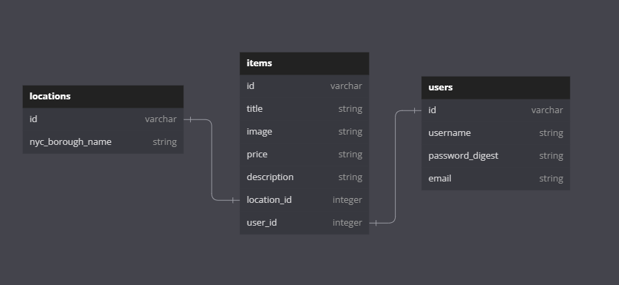

# Easy Sell Easy Buy (ESEB)


Buy and sell any items you desire within NYC area.

## Description

ESEB is a single page application built with React.js for the frontend and Ruby on Rails with PostgreSQL for the backend. Purpose of the app is to buy and sell any items easily across the area of NYC. 
A user must signup and login to use the app. A user's password is secured and encrypted with BCrytp gem in the backend. Also, implementing authentication and authorization. There are 4 client-side routes using React Router following RESTful convention routes. Users can easily navigate through different routes using NavBar on top of the app by clicking on the different links. After login, the app redirects the user to the home page which now shows the welcome message with the username and a link 'Click to see your items'. If you click the link, it will show all the items that were posted by that specific user. Each item has edit and delete buttons. It gives permission to edit or delete an item specific to that user. In addition, a user can click the 'All Items' link to browse all items posted by all users. 'Post an item' link redirects to a form page to post a new item. All the models have attribute validations, so a user must not leave a black space/s or else it will throw error messages. Furthermore, a user can find items belonging to a specific borough of NYC by clicking the 'items by location' link. Finally, a user can log out by clicking the 'logout' link, which will destroy the session hash.

### Models and Relationship

There are 3 models for this app. User, Item and Location models. These models have many-to-many relationships. Item model is the join table that holds the two foreign keys from User and Location models. Therefore, an Item belongs to a User and belongs to a Location. User has many Items and has many Locations through Items. Location has many Items and has many Users through Items.

# 

## Setting up

Start by **cloning** the project

```console

$ git clone git@github.com:thyoon515/easy-sell-easy-buy.git
$ cd easy-sell-easy-buy

```

Furthermore, you must bundle install, create database in rails and install npm --prefix client by running,

```sh

bundle install
rails db:create
npm install --prefix client

```
Lastly, start psql service, run rails server and start npm --prefix client,

```sh

sudo service postgresql start
rails s
npm start --prefix client

```

Additionally, the app is deployed on [Render](https://easy-sell-easy-buy.onrender.com).

### How to use the app


## Credit
